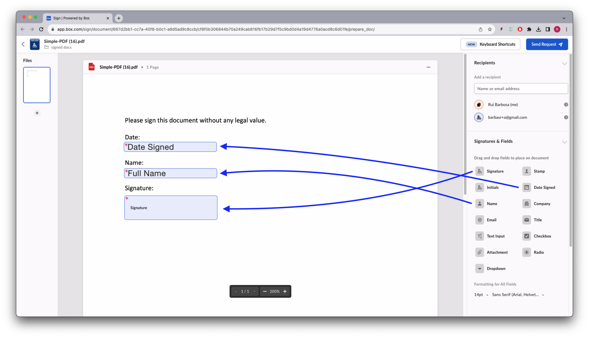

# Sign request

The sign request endpoint is used to create and manage signature requests. 
You can create, resend, and cancel signature requests. 
You can also list all signature requests and get details 
of a specific signature request.

The main endpoint is `https://{api.box.com}/2.0/sign_requests`.
The following table lists the operations that you can perform on this endpoint.

| Operation | Endpoint | Description |
| --- | --- | --- |
| GET | /sign_requests | List all signature requests. |
| GET | /sign_requests/:id | Get details of a specific signature request. |
| POST | /sign_requests | Create a signature request. |
| POST | /sign_requests/:id/resend | Resend a signature request. |
| POST | /sign_requests/:id/cancel | Cancel a signature request. |

## Creating your first signature request

Imagine that you have a document stored in Box and you want to send it to a 
customer for signature. At minimum your app will need to know what document to 
sign, where to store the signed document, and the signer email.

You can use the Box Sign API or one of the available SDK's to create a 
signature request. Consider this sample method:

<Tabs>
  <Tab title='Python Gen SDK'>

```python

def sign_doc_single(
    client: Client,
    document_id: str,
    destination_folder_id: str,
    signer_email: str,
    prep_needed: bool = False,
) -> SignRequest:
    """Single doc sign by single signer"""

    # Sign request params
    source_file = FileBase(id=document_id, type=FileBaseTypeField.FILE)
    destination_folder = FolderMini(
        id=destination_folder_id, type=FolderBaseTypeField.FOLDER
    )
    signer = SignRequestCreateSigner(signer_email)
    # sign document
    sign_request = client.sign_requests.create_sign_request(
        signers=[signer],
        parent_folder=destination_folder,
        source_files=[source_file],
        is_document_preparation_needed=prep_needed,
    )

    return sign_request

```

  </Tab>
</Tabs>

Because we are requesting a signature for a generic document, Box Sign doesn't 
know where to put the signature pad or any other of the inputs available to 
Sign, such as text fields, date, check-boxes, and so on.

In these cases, you should always call the create signature request endpoint 
with the `is_document_preparation_needed` parameter set to `true`. 

This will create a signature request with a document preparation step, and 
returning a preparation URL, where the requester can prepare the document for 
signing.

For example:

<Tabs>
  <Tab title='Python Gen SDK'>

```python

    def main()
    ...
    # Simple sign a pdf request with preparation
    sign_pdf_prep = sign_doc_single(
        client, SIMPLE_PDF, SIGN_DOCS_FOLDER, SIGNER_A, True
    )
    check_sign_request(sign_pdf_prep)
    if sign_pdf_prep.prepare_url is not None:
        open_browser(sign_pdf_prep.prepare_url)

```

  </Tab>
</Tabs>

Resulting in:

```YAML

Simple sign request with prep: xyz-abc-123
  Status: converting
  Signers: ...@gmail.com
Prepare url: https://app.box.com/sign/document/xyz-abc-123/.../prepare_doc/

```

Your application should open the preparation URL in a browser, where the 
requester can add the signature pad and any other inputs needed for the signer 
to complete the document.



Once the document is prepared, the requester can send the signature request to 
the signer.

Back in the Box app you can see the status of the as `In Progress`.


The signer then receives an email from Box with a link to the signature 
request. The signer can click the link and sign the document.


When the process is completed, both a signature log containing metadata and 
the signed document are stored in the destination folder.


Congratulations! You have successfully created your first signature request.

<Message type='notice'>
This represents the simplest use case for Box Sign. The create method has many 
options that you can use to customize your signature request.
Be sure to check the [Signature request](./10-sign-request.md), and the 
[Technical use cases](./30-technical-use-cases.md) sections for more 
information.
</Message>

## List sign requests

## Get sign request details

## Resend sign requests

## Cancel sign requests
