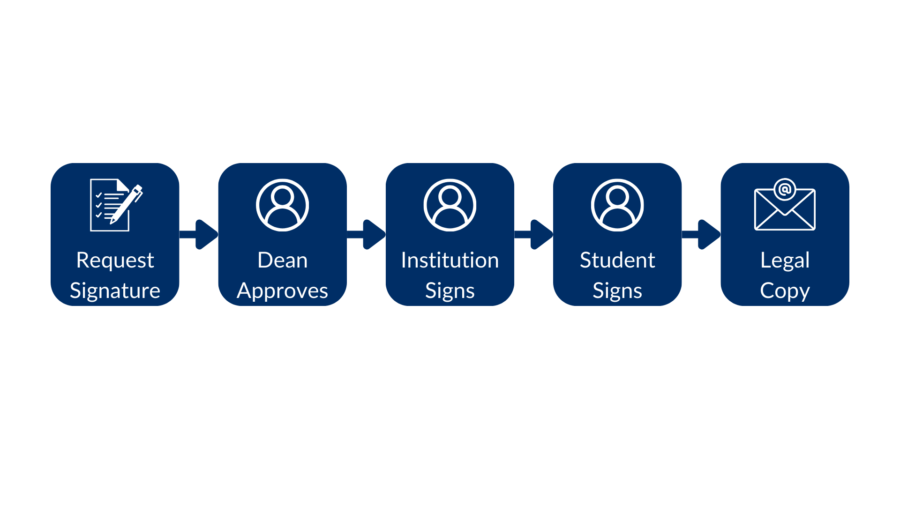

# Multiple signers and roles

## Multiple signers

What if you have a document that needs to be signed by multiple people? This is
typical for contracts between two or more entities.

Having multiple signers introduces another dimension to the Box Sign process,
the order in which the signers need to sign the document.

If you do not specify the order, the request is sent to everyone at the same
time, and when all parties have signed the document, they each receive a copy
with all signatures.

If you specify the signing order, the signature request is sent to the first
signer. Only when the first signer signs the document, the request is sent to
the second signer, and so on.

Let’s see this working with an example scholarship contract between a
university and a student. In this case the institution/teacher must sign the
document first.

Creating a method specific for this:

<Tabs>
<Tab title='cURL'>

```bash

curl --location 'https://api.box.com/2.0/sign_requests' \
--header 'Content-Type: application/json' \
--header 'Authorization: Bearer ej...3t'
--data-raw '{
    "is_document_preparation_needed": true,
    "parent_folder": {
        "id": "234102987614",
        "type": "folder"
    },
    "source_files": [
        {
            "id": "1358047520478",
            "type": "file"
        }
    ],
    "signers": [
        {
            "email": "institution@example.com",
            "role": "signer",
            "order":1
        },
        {
            "email": "student@example.com",
            "role": "signer",
            "order":2
        },
    ]
}'

```

</Tab>
<Tab title='Python Gen SDK'>

```python

def sign_contract(
    client: Client,
    document_id: str,
    destination_folder_id: str,
    institution_email: str,
    student_email: str,
    prep_needed: bool = False,
) -> SignRequest:
    """Sign contract"""

    # Sign request params
    source_file = FileBase(id=document_id, type=FileBaseTypeField.FILE)
    destination_folder = FolderMini(
        id=destination_folder_id, type=FolderBaseTypeField.FOLDER
    )

    # signers
    institution = SignRequestCreateSigner(
        email=institution_email,
        role=SignRequestCreateSignerRoleField.SIGNER,
        order=1,
    )

    student = SignRequestCreateSigner(
        email=student_email,
        role=SignRequestCreateSignerRoleField.SIGNER,
        order=2,
    )

    # create sign request
    sign_request = client.sign_requests.create_sign_request(
        signers=[institution, student],
        parent_folder=destination_folder,
        source_files=[source_file],
        is_document_preparation_needed=prep_needed,
    )

    return sign_request

def main():
    ...

    # Multiple signers
    sign_contract_multi = sign_contract(
        client,
        CONTRACT,
        SIGN_DOCS_FOLDER,
        institution_email=SIGNER_A,
        student_email=SIGNER_B,
        prep_needed=True,
    )
    if sign_contract_multi.prepare_url is not None:
        open_browser(sign_contract_multi.prepare_url)

```

</Tab>
</Tabs>

In this particular example the document needs to be prepared, so the browser to
the prepare URL opens.

Drag the signature pad, the full name and the date to the appropriate places in
the document, and click Send Request:


Notice you now have two signers, with the order already specified. The `color`
is also important to identify which signer is which (in this case the
institution is blue and the student is green), determining which signature pad,
name and date belongs to which signer.

If you look at the signature request details, you should see something like
this:


Indicating that the first request was sent, but the second is waiting for the
first to be completed.

Go ahead and complete the signature process for both signers.

Notice that when you get the second request it is already signed by the first
signer.

## Roles

So far we have been working with the `signer` role. However there are [other
roles][roles] that you can use to customize the signature process.

The available roles are, `signer`, `approver`, and `final copy reader`

From a developer perspective, this means:

- **Signer**: Any person who is allowed to add data to the document. This includes adding a signature, initials, date, but also filling out text fields, check boxes, and radio buttons, even if it does not include a signature.

- **Approver**: This role will be asked if they approve the signature request. This approval happens before the preparation step, if enabled, and before the request is sent to any of the signers. This role is useful if you need to get approval from someone before sending the document to the signers.

- **Final copy reader**: This role does not interact with the signature process, but will receive a copy of the signed document.

Let's use roles to be a bit more creative in the scholarship example.

Imagine that the scholarship needs to be approved by the dean, and the legal
department receives a final copy of the contract.

The flow starts with the signature request, flowed by the dean approval, the
institution signature, the student signature, and finally the legal
department receives a copy of the signed document:



Let's create a method for this:

<Tabs>
<Tab title='cURL'>

```bash

curl --location 'https://api.box.com/2.0/sign_requests' \
--header 'Content-Type: application/json' \
--header 'Authorization: Bearer ej...3t'
--data-raw '{
    "is_document_preparation_needed": true,
    "parent_folder": {
        "id": "234102987614",
        "type": "folder"
    },
    "source_files": [
        {
            "id": "1358047520478",
            "type": "file"
        }
    ],
    "signers": [
        {
            "email": "institution@example.com",
            "role": "signer",
            "order":1
        },
        {
            "email": "student@example.com",
            "role": "signer",
            "order":2
        },
        {
            "email": "dean@example.com",
            "role": "approver"
        },
        {
            "email": "legal@example.com",
            "role": "final_copy_reader"
        }
    ]
}'

```

</Tab>
<Tab title='Python Gen SDK'>

```python

def sign_contract_step(
    client: Client,
    document_id: str,
    destination_folder_id: str,
    institution_email: str,
    student_email: str,
    dean_email: str,
    legal_email: str,
) -> SignRequest:
    """Sign contract"""

    # Sign request params
    source_file = FileBase(id=document_id, type=FileBaseTypeField.FILE)
    destination_folder = FolderMini(
        id=destination_folder_id, type=FolderBaseTypeField.FOLDER
    )

    # signers
    institution = SignRequestCreateSigner(
        email=institution_email,
        role=SignRequestCreateSignerRoleField.SIGNER,
        order=1,
    )

    student = SignRequestCreateSigner(
        email=student_email,
        role=SignRequestCreateSignerRoleField.SIGNER,
        order=2,
    )

    dean = SignRequestCreateSigner(
        email=dean_email,
        role=SignRequestCreateSignerRoleField.APPROVER,
    )

    legal = SignRequestCreateSigner(
        email=legal_email,
        role=SignRequestCreateSignerRoleField.FINAL_COPY_READER,
    )

    # create sign request
    sign_request = client.sign_requests.create_sign_request(
        signers=[institution, student, dean, legal],
        parent_folder=destination_folder,
        source_files=[source_file],
        is_document_preparation_needed=True,
    )

    return sign_request

def main():
    ...

    # Multiple signers and steps
    sign_contract_multi_step = sign_contract_step(
        client,
        CONTRACT,
        SIGN_DOCS_FOLDER,
        institution_email=SIGNER_A,
        student_email=SIGNER_B,
        dean_email=APPROVER,
        legal_email=FINAL_COPY,
    )
    if sign_contract_multi_step.prepare_url is not None:
        open_browser(sign_contract_multi_step.prepare_url)

```

</Tab>
</Tabs>

Like before you need to prepare the document, so open the prepare URL in your
browser.

Notice in the example the institution is represented by blue on the
left, and the student by green on the right, and both are signers.

Neither the `approver` nor the `final copy reader` can have inputs associated
with them. If you do this, their roles will be adjusted to `signer`:


Continuing the signature process:

- The dean approves the scholarship
- The institution signs the scholarship
- The student signs the scholarship
- The legal department receives a copy of the signed document.

[roles]: https://support.box.com/hc/en-us/articles/4404105660947-Roles-for-signers