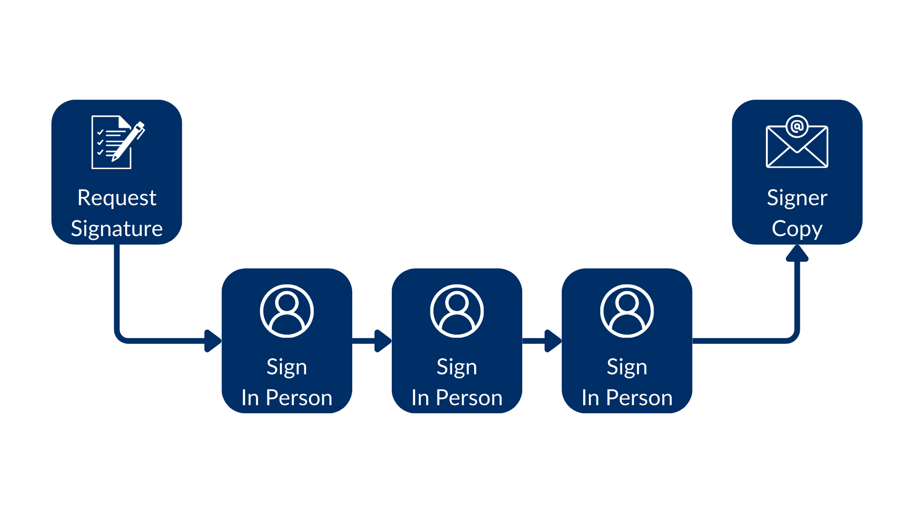
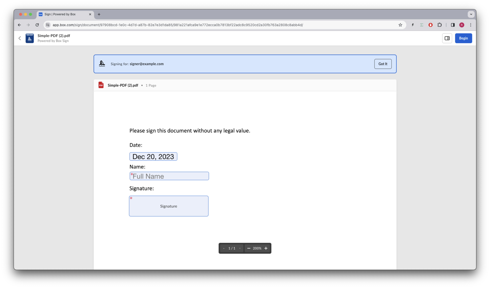
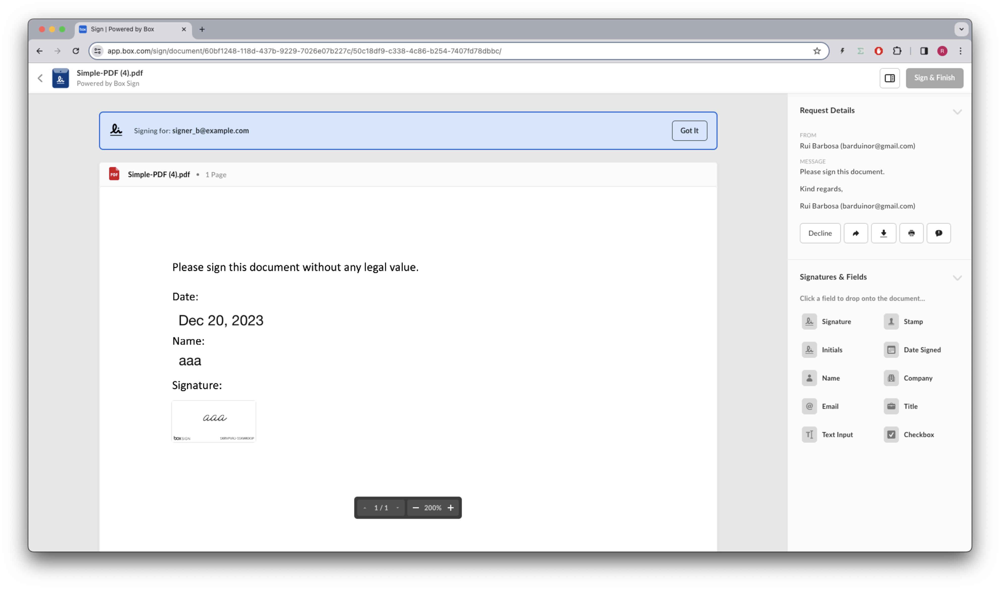

# In person signatures

Imagine your application is used by a sales person when they are face to face 
with a customer and an immediate signature is required, for example, to 
subscribe to a service or to confirm a purchase. 

In this case, the sales person can use your application to create a signature 
request and then hand over the device to the customer to sign the document, 
immediately closing the deal.

Doing this using the Box web application, for example from a template, is very 
straightforward. You set the signer or signers email so they can receive a copy 
of the signed document, flag them as in person, and as soon as you send the 
request, the sign interface opens requesting the signature for the 
first signer, then for the second signer, and so on.

In order to use this within your application, you need to create a signature 
request with the `is_in_person` flag set to `true` for each signer.

However because your application needs to show the Sign interface to the 
signer, you also need to use the `embed_url_external_user_id`so that you get 
back the embedded URLs, and then either open a browser window or use an iframe 
to display the signature interface.



## Create an in person signature request

Let's use a template with a single signer as an example:

<Tabs>
<Tab title='cURL'>
    
```bash

curl --location 'https://api.box.com/2.0/sign_requests' \
--header 'Content-Type: application/json' \
--header 'Authorization: Bearer Le...Cb'
--data-raw '{
    "template_id":"ee9a689e-96b6-4076-92a0-b9b765eb09ca",
    "parent_folder": {
        "id": "234102987614",
        "type": "folder"
    },
    "signers": [
        {
            "email": "signer@example.com",
            "role": "signer",
            "is_in_person":true,
            "embed_url_external_user_id":"1234"
        }
    ]
}'
    
```
    
</Tab>
<Tab title='Python Gen SDK'>

```python

def sign_doc_in_person(
    client: Client,
    document_id: str,
    destination_folder_id: str,
    signer_email: str,
    signer_embed_url_id: str,
) -> SignRequest:
    # Sign request params
    source_file = FileBase(id=document_id, type=FileBaseTypeField.FILE)
    destination_folder = FolderMini(
        id=destination_folder_id, type=FolderBaseTypeField.FOLDER
    )

    signer = SignRequestCreateSigner(
        email=signer_email,
        embed_url_external_user_id=signer_embed_url_id,
        is_in_person=True,
    )

    # sign document
    sign_request = client.sign_requests.create_sign_request(
        signers=[signer],
        parent_folder=destination_folder,
        source_files=[source_file],
    )

    return sign_request


def main():
    """Simple script to demonstrate how to use the Box SDK"""
    conf = ConfigOAuth()
    client = get_client_oauth(conf)
    # Sign with phone verification
    sign_with_embed_url = sign_doc_embed_url(
        client,
        SIMPLE_PDF,
        SIGN_DOCS_FOLDER,
        SIGNER_A,
        SIGNER_A_EXTERNAL_ID,
    )
    check_sign_request(sign_with_embed_url)    

```

</Tab>
</Tabs>

Resulting in (simplified):

<Tabs>
<Tab title='cURL'>
    
```json

{
    "signers": [
        {
            "email": "sender@example.com",
            "role": "final_copy_reader",
            "is_in_person": false,
        },
        {
            "email": "signer@example.com",
            "role": "signer",
            "is_in_person": true,
            "embed_url_external_user_id": "1234",
            "embed_url": "https://app.box.com/sign/document/...",
            "iframeable_embed_url": "https://app.box.com/embed/sign/document/..."
        }
    ],
    "id": "a9159d31-d2fb-4e88-9306-02c00de013d1",
    "parent_folder": {
        "id": "234102987614",
        "type": "folder",
        "name": "signed docs"
    },
    "name": "Simple-PDF (1).pdf",
    "type": "sign-request",
    "status": "created",
    "template_id": "ee9a689e-96b6-4076-92a0-b9b765eb09ca"
}
    
```
    
</Tab>
<Tab title='Python Gen SDK'>

```yaml

Simple sign request: a9159d31-d2fb-4e88-9306-02c00de013d1
  Status: created
  Signers: 2
    final_copy_reader: sender@example.com
    signer: signer@example.com
    embed_url: https://app.box.com/sign/document/...
    iframeable_embed_url: https://app.box.com/embed/sign/document/...
  Prepare url: None

```

</Tab>
</Tabs>

Notice the `embed_url` and `iframeable_embed_url` in the response. Now when we 
browse to the embed URL, you see the signature interface:



Once finished the signer will receive a copy of the signed document via their 
email.

## Multiple in person signers

As long as the signer is flagged as `is_in_person`, the signing interface 
cycles through all the signers in the request.

For example, if you add a second signer to the request:

<Tabs>
<Tab title='cURL'>
    
```bash

curl --location 'https://api.box.com/2.0/sign_requests' \
--header 'Content-Type: application/json' \
--header 'Authorization: Bearer Le...Cb'
--data-raw '{
    "template_id":"ee9a689e-96b6-4076-92a0-b9b765eb09ca",
    "parent_folder": {
        "id": "234102987614",
        "type": "folder"
    },
    "signers": [
        {
            "email": "signer_a@example.com",
            "role": "signer",
            "is_in_person":true,
            "embed_url_external_user_id":"1234"
        },
        {
            "email": "signer_b@example.com",
            "role": "signer",
            "is_in_person":true
        }
    ]
}'
    
```
    
</Tab>
<Tab title='Python Gen SDK'>

```python

def sign_doc_in_person_multiple(
    client: Client,
    document_id: str,
    destination_folder_id: str,
    signer_a_email: str,
    signer_a_embed_url_id: str,
    signer_b_email: str,
) -> SignRequest:
    # Sign request params
    source_file = FileBase(id=document_id, type=FileBaseTypeField.FILE)
    destination_folder = FolderMini(
        id=destination_folder_id, type=FolderBaseTypeField.FOLDER
    )

    signer_a = SignRequestCreateSigner(
        email=signer_email,
        embed_url_external_user_id=signer_embed_url_id,
        is_in_person=True,
    )

    signer_b = SignRequestCreateSigner(
        email=signer_email,
        is_in_person=True,
    )

    # sign document
    sign_request = client.sign_requests.create_sign_request(
        signers=[signer_a, signer_b],
        parent_folder=destination_folder,
        source_files=[source_file],
    )

    return sign_request


def main():
    """Simple script to demonstrate how to use the Box SDK"""
    conf = ConfigOAuth()
    client = get_client_oauth(conf)
    # Sign with phone verification
    sign_with_embed_url = sign_doc_embed_url(
        client,
        SIMPLE_PDF,
        SIGN_DOCS_FOLDER,
        SIGNER_A,
        SIGNER_A_EXTERNAL_ID,
        SIGNER_B
    )
    check_sign_request(sign_with_embed_url)   

```

</Tab>
</Tabs>

Results in (simplified):

<Tabs>
<Tab title='cURL'>
    
```json

{
    "signers": [
        {
            "email": "sender@example.com",
            "role": "final_copy_reader",
            "is_in_person": false,
        },
        {
            "email": "signer_a@example.com",
            "role": "signer",
            "is_in_person": true,
            "embed_url": "https://app.box.com/sign/document/...",
            "iframeable_embed_url": "https://app.box.com/embed/sign/document/..."
        },
        {
            "email": "signer_b@example.com",
            "role": "signer",
            "is_in_person": true,
            "embed_url": null,
            "iframeable_embed_url": null
        }
    ],
    "id": "d066575f-f22b-42fc-b9e2-701468776475",
    "parent_folder": {
        "id": "234102987614",
        "type": "folder",
        "name": "signed docs"
    },
    "name": "Simple-PDF (3).pdf",
    "type": "sign-request",
    "status": "created",
    "template_id": "ee9a689e-96b6-4076-92a0-b9b765eb09ca"
}
    
```
    
</Tab>
<Tab title='Python Gen SDK'>

```yaml

Simple sign request: d066575f-f22b-42fc-b9e2-701468776475
  Status: created
  Signers: 3
    final_copy_reader: sender@example.com
    
    signer: signer_a@example.com
    embed_url: https://app.box.com/sign/document/...
    iframeable_embed_url: https://app.box.com/embed/sign/document/...

    signer: signer_b@example.com

  Prepare url: None

```

</Tab>
</Tabs>

Browsing to the embed URL shows the signature interface for the first 
signer:


Once the first signer has signed, the signature interface automatically 
switches to the second signer:

