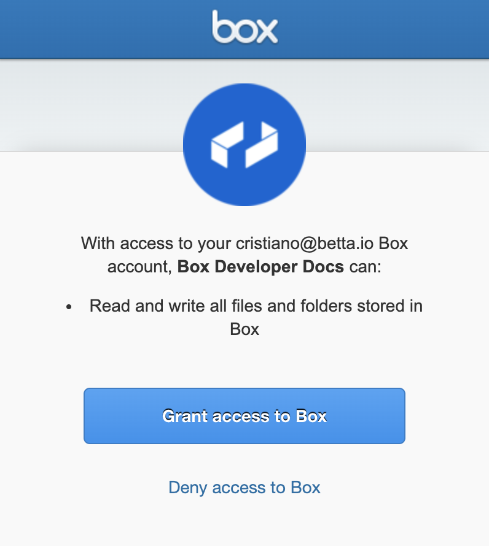

# SDKを使用したOAuth 2.0

Box SDKには、クライアント側OAuth 2.0のサポートが組み込まれています。

このプロセスでは、ユーザーはブラウザでBoxウェブアプリにリダイレクトされます。そこで、ユーザーはログインし、アプリケーションによる自分のデータへのアクセスを承認すると、アプリケーションの`redirect_url`に再度リダイレクトされます。この最後の手順では、ユーザーがアクセス可能な場所にあるウェブサーバー上でアプリケーションが実行されている必要があります。

## 概要

OAuth 2.0フローを完了するには、以下の手順を完了する必要があります。

1. Box SDKを構成する
2. ユーザーをBoxウェブサイトにリダイレクトする
3. ユーザーがアプリケーションにアクセス権限を付与する
4. 承認コードをアクセストークンと交換する

このフローが終了すると、アプリケーションには、このユーザーの代わりにAPIコールを実行するために使用できるアクセストークンが用意されます。

<Message notice>

OAuth 2.0を介して取得したアクセストークンは、もともとアプリケーションを承認したユーザーに関連付けられています。このトークンを使用して実行されるAPIコールはどれも、このアプリケーションから実行されているように見えるため、ユーザーには、アプリケーションがこのトークンを使用してアクセスしようとするファイルやフォルダへのアクセス権限が必要です。

</Message>

## パラメータ

<!-- markdownlint-disable line-length -->

| パラメータ           | 説明                                                              |
| --------------- | --------------------------------------------------------------- |
| `CLIENT_ID`     | アプリケーションのクライアントIDまたはAPIキー                                       |
| `CLIENT_SECRET` | アプリケーションのクライアントシークレットまたはAPIシークレット                               |
| `REDIRECT_URI`  | ユーザーがアプリケーションを承認した後に送信されるアプリケーションのリダイレクトURL。これは開発者コンソールで構成できます。 |

<!-- markdownlint-enable line-length -->

## 1. SDKを構成する

最初の手順として、選択したSDKを使用して環境が準備されていることを確認します。

<Tabs>

<Tab title=".NET">

```dotnet
var redirectUrl = "[REDIRECT_URI]";
var config = new BoxConfig("[CLIENT_ID]", "[CLIENT_SECRET]", new Uri(redirectUrl));
var sdk = new BoxClient(config);

```

</Tab>

<Tab title="Java">

<!-- markdownlint-disable line-length -->

```java
import com.box.sdk.BoxAPIConnection;

String authorizationUrl = "https://account.box.com/api/oauth2/authorize?client_id=[CLIENT_ID]&response_type=code";

```

<!-- markdownlint-enable line-length -->

</Tab>

<Tab title="Python">

```python
from boxsdk import OAuth2, Client

auth = OAuth2(
    client_id='[CLIENT_ID]',
    client_secret='[CLIENT_SECRET]'
)

```

</Tab>

<Tab title="Node">

```js
var BoxSDK = require("box-node-sdk");

var sdk = new BoxSDK({
  clientID: "[CLIENT_ID]",
  clientSecret: "[CLIENT_SECRET]",
});

```

</Tab>

</Tabs>

<CTA to="guide://tooling/sdks">

ご利用の環境に合わせたSDKのインストールの詳細を確認する

</CTA>

## 2. ユーザーをリダイレクトする

次に、承認URLにユーザーをリダイレクトします。ほとんどのSDKでは、SDKクライアントの承認URLを取得する方法をサポートしています。

<Message warning>

アプリケーション用にリダイレクトURIを複数設定した場合、承認URLには、開発者コンソールで設定したURIのいずれかと一致する`redirect_uri`パラメータを含める必要があります。このパラメータが指定されていない場合、ユーザーがアプリケーションにアクセス権限を付与すると、`redirect_uri_missing`エラーが表示され、アプリにリダイレクトされません。

</Message>

<Tabs>

<Tab title=".NET">

```dotnet
var authorizationUrl = "https://account.box.com/api/oauth2/authorize?client_id=[CLIENT_ID]&response_type=code";
// redirectTo(authorizationUrl);

```

</Tab>

<Tab title="Java">

<!-- markdownlint-disable line-length -->

```java
String authorizationUrl = "https://account.box.com/api/oauth2/authorize?client_id=[CLIENT_ID]&response_type=code";

// response.redirect(authorizationUrl);

```

<!-- markdownlint-enable line-length -->

</Tab>

<Tab title="Python">

```python
auth_url, csrf_token = auth.get_authorization_url('[REDIRECT_URL]')

// redirect(auth_url, code=302)

```

</Tab>

<Tab title="Node">

```js
var authorize_url = sdk.getAuthorizeURL({
  response_type: "code",
});

// res.redirect(authorize_url)

```

</Tab>

</Tabs>

<Message>

ユーザーがURLにリダイレクトされる方法は、使用されるアプリケーションフレームワークによって異なります。このトピックの詳細については、ほとんどのフレームワークのドキュメントで説明されています。

</Message>

[承認URL](endpoint://get-authorize)は、以下のように手動でも作成できます。

<!-- markdownlint-disable line-length -->

```curl
https://account.box.com/api/oauth2/authorize?client_id=[CLIENT_ID]&redirect_uri=[REDIRECT_URI]&response_type=code

```

<!-- markdownlint-enable line-length -->

<Message>

スコープを制限したり追加の状態を渡したりするためにユーザーをリダイレクトするときに、追加のクエリパラメータを渡すことができます。詳細については、[リファレンスドキュメント](endpoint://get-authorize)を参照してください。

</Message>

<Message type="tip">

Boxインスタンスの[Box Verified Enterprise][1]が有効になっている場合、標準的な`account.box.com`というベースURLを使用する際に問題が発生することがあります。`account.box.com`の代わりに`ent.box.com`を使用してください。

</Message>

## 3. ユーザーがアプリケーションにアクセス権限を付与する

ユーザーはBoxウェブアプリにリダイレクトされると、ログインする必要があります。ログイン後、ユーザーにはアプリケーションを承認するための画面が表示されます。

<ImageFrame border center shadow width="400">



</ImageFrame>

ユーザーがこのリクエストを承認し、ボタンをクリックすると、ブラウザは、開発者コンソールで構成されたとおりにアプリケーションのリダイレクトURLにリダイレクトされます。

## 4. コードを交換する

ユーザーは、有効期間の短い承認コードを含むクエリパラメータが指定されたアプリケーションのリダイレクトURLにリダイレクトされます。

```curl
https://your.domain.com/path?code=1234567

```

このコードは[アクセストークン][tokens]ではなく、有効期間はほんの数秒です。SDKを使用すると、このコードを実際のアクセストークンと交換できます。

<Tabs>

<Tab title=".NET">

```dotnet
var session = await sdk.Auth.AuthenticateAsync("[CODE]");
var client = new BoxClient(config, session);

```

</Tab>

<Tab title="Java">

```java
BoxAPIConnection client = new BoxAPIConnection(
  "[CLIENT_ID]",
  "[CLIENT_SECRET]",
  "[CODE]"
);

```

</Tab>

<Tab title="Python">

```python
auth.authenticate('[CODE]')
client = Client(auth)

```

</Tab>

<Tab title="Node">

```js
var code = "...";

sdk.getTokensAuthorizationCodeGrant("[CODE]", null, function (err, tokenInfo) {
  var client = sdk.getPersistentClient(tokenInfo);
});

```

</Tab>

</Tabs>

このフローが終了すると、アプリケーションには、このユーザーの代わりにAPIコールを実行するために使用できるアクセストークンが用意されます。

## SDKとOAuth 2.0の使用

各SDKのOAuth 2.0認証の詳細については、以下を参照してください。

* [.Net][.Net]

* [Java][Java]

* [Python][Python]

* [Node][Node]

* [IOS][IOS]

[.Net]: https://github.com/box/box-windows-sdk-v2/blob/main/docs/authentication.md#traditional-3-legged-oauth2

[Java]: https://github.com/box/box-java-sdk/blob/main/doc/authentication.md#standard-3-legged-oauth-20

[Python]: https://github.com/box/box-python-sdk/blob/main/docs/usage/authentication.md#traditional-3-legged-oauth2

[Node]: https://github.com/box/box-node-sdk/blob/main/docs/authentication.md#traditional-3-legged-oauth2

[IOS]: https://github.com/box/box-ios-sdk/blob/main/docs/usage/authentication.md#traditional-3-legged-oauth2

[tokens]: g://authentication/tokens/access-tokens

<!-- i18n-enable localize-links -->

[1]: https://support.box.com/hc/ja/articles/360043693554-Box-Verified-Enterpriseとサポート対象のアプリ

<!-- i18n-disable localize-links -->
