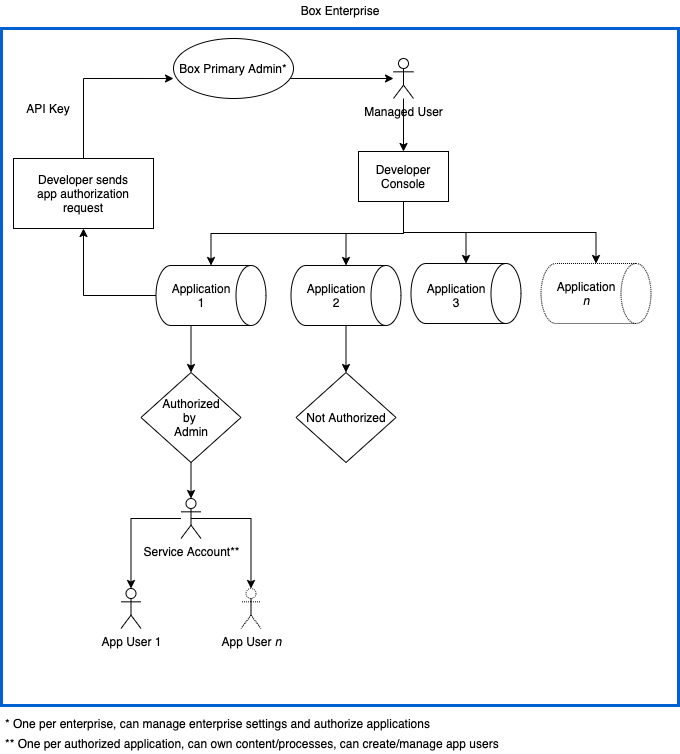
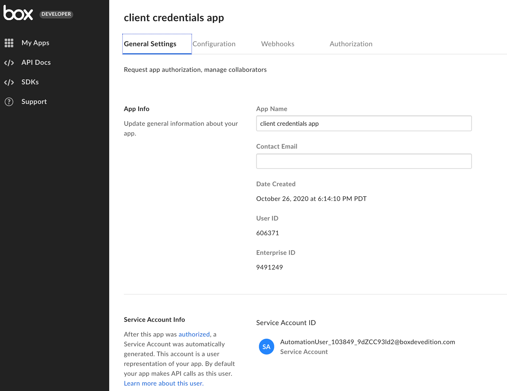

# サービスアカウント

サービスアカウントにより、開発者は、サーバー側のBoxとの統合にプログラムによる認証メカニズムを使用できます。つまり、アプリケーションはBoxに対してサービスとして認証を受けることでき、これがサービスアカウントユーザーで表されます。その後、サービスアカウントを使用して、[App User][appusers]と呼ばれるアプリケーション固有のユーザーを他に作成できます。

<ImageFrame center shadow border>

</ImageFrame>

## 作成

サーバー認証を利用するアプリケーションが管理コンソールで[承認][auth]されるとすぐに、一意のBoxサービスアカウントが自動的に生成されます。その時点から、そのサービスアカウントはBox Enterprise内のアプリケーションを表します。すべてのBoxアカウントにはメールアドレスが必要なため、Boxによって割り当てられます。これは常に`AutomationUser_AppServiceID_RandomString@boxdevedition.com`形式になります (例: `AutomationUser_123456_6jCo6Pqwo@boxdevedition.com`)。サービスアカウントが自動化ユーザーと呼ばれることがあるのはこのためです。

アンダースコアで囲まれた数字もアプリケーションに固有であり、サービスIDと呼ばれます。[開発者コンソール][dc]でサービスIDを見つけるには、アプリケーションのタイルをクリックし、URLを確認します。たとえば、`https://example.app.box.com/developers/console/app/123456`というURLの場合、このアプリケーションは、上記の例で示したサービスアカウントに対応していることがわかります。

デフォルトでは、ほとんどのサービスアカウントに10 GBのストレージが割り当てられます。これは、サービスアカウントが管理コンソールの \[**ユーザー設定**] タブにある \[**新規ユーザーの初期設定**] で設定されたストレージ割り当てに従うためです。この容量は、企業がこの設定を更新したかどうかによって異なる場合があります。サービスアカウントに割り当てられているストレージの容量をアカウント作成後に更新するには、[ユーザーを更新][updateuser]エンドポイントに対するAPIコールを実行し、`space_amount`本文パラメータを使用して目的の値 (バイト単位) を渡します。

サービスアカウントが生成されると、[開発者コンソール][dc]の \[一般設定] タブにセクションが自動的に追加され、メールアドレスが表示されます。

<ImageFrame center shadow border>

</ImageFrame>

アプリケーションが管理コンソールで承認される前に、ユーザーがサービスアカウントアクセストークンを使用してAPIコールを実行しようとすると、次のエラーメッセージが表示されます: `"error":"unauthorized_client"` `"error_description": "This app is not authorized by the enterprise"`

## ユースケース

* _ディストリビューションの公開_: 認証されているかどうかに関係なく、ファイルをアップロードし、多数のユーザーと共有します。
* _オンプレミスのシステムとデバイス_: オンプレミスシステムや接続されたデバイスからプログラムによってコンテンツを取り込みます。 
* _コンテンツの移行と監視_: コンテンツをオンプレミスからクラウドへ移動したり、クラウドプロバイダ間で移動したりします。  
* _イベント監視_: 社内のイベントを監視して、アクションに基づいてコンプライアンス順守を確保したり、ワークフローをトリガーしたりします。
* _コンテンツのアーカイブ_: 最低限しかアクセスされないコンテンツを格納します。

## 権限

サービスアカウントアクセストークンで問題なく操作できるエンドポイントは、[開発者コンソール][dc]で構成されたアプリケーション[スコープ][scopes]によって決まります。付与されているスコープによっては、サービスアカウントが管理者アクションを実行できる場合があります。 

<Message type="warning">

# 管理者の承認

適切な[スコープ][scopes]が有効になっている場合、サービスアカウントは多くの管理者アクションを実行できます。そのため、JWTアプリケーションを社内で使用できるようにするには、事前に明示的な[管理者による承認][auth]が必要です。

</Message>

## UIでのアクセス

管理コンソールの[コンテンツマネージャ][cm]からサービスアカウントとしてログインできるのは、プライマリ管理者のみです。これには、コンテンツマネージャの検索バーを使用してアプリケーションの名前を見つけ、その名前を右クリックして \[ユーザーのアカウントにログイン] を選択します。

サービスアカウントは、Boxの共同管理者の権限を持っていると考えることができます。共同管理者がお互いを管理できないのと同じように、共同管理者がサービスアカウントユーザーとしてログインすることはできません。

サービスアカウントは、現在、管理コンソールの \[ユーザーとグループ] タブに表示されていません。

## フォルダツリーとコラボレーション

サービスアカウントは、アプリケーションをEnterprise内のユーザーとして表すため、独自のフォルダツリーとコンテンツ所有権の機能が用意されています。最初は、所有するコンテンツやコラボレーションするコンテンツがないため、このフォルダツリーはデフォルトで空になっています。これは、新しくプロビジョニングしたBoxアカウントの \[すべてのファイル] ページに最初にアクセスしたときと似ています。

既存のコンテンツでのコラボレーションにサービスアカウントを追加するには、他のユーザーの場合と同様、割り当てられたメールアドレスを使用してサービスアカウントを招待します。[APIを使用して][collabapi]コラボレーションを追加する場合は、すでにコンテンツへのアクセス権があり、コラボレータを招待するための適切なコラボレーション権限を持っているユーザーのアクセストークンを使用する必要があります。また、サービスアカウントのユーザーIDも使用します。このユーザーIDは、サービスアカウントのアクセストークンを使用して[現在のユーザーを取得エンドポイント][getuser]を呼び出したときに返されます。

<Message type="notice">

コラボレーションを追加する際に覚えやすくなるよう、サービスアカウントにメールエイリアスを割り当てることができます。

</Message>

## Box View

サービスアカウントは、[開発者コンソール][dc]でアクセス制限付きアプリを作成したときにも自動的に生成されます。このサービスアカウントには、カスタムアプリに関連付けられたサービスアカウントにはない追加の制限がいくつかあります。

* アクセス制限付きアプリ内で使用されるコンテンツはすべて、このサービスアカウントがアップロードおよび所有する必要がある
* このサービスアカウントは、他のユーザーの情報やコンテンツにアクセスできない
* このサービスアカウントは、タイプを問わず新しいユーザーを作成することも管理することもできない
* このサービスアカウントは、コンテンツのプレビューに関連するAPIのサブセットにしかアクセスできない

[appusers]: g://getting-started/user-types/app-users/

[auth]: g://authorization/custom-app-approval/

[dc]: https://app.box.com/developers/console

[scopes]: g://api-calls/permissions-and-errors/scopes/

<!-- i18n-enable localize-links -->

[cm]: https://support.box.com/hc/ja/articles/360044197333-コンテンツマネージャの使用

<!-- i18n-disable localize-links -->

[collabapi]: e://post-collaborations/

[getuser]: e://get-users-me/

[updateuser]: e://put-users-id/
