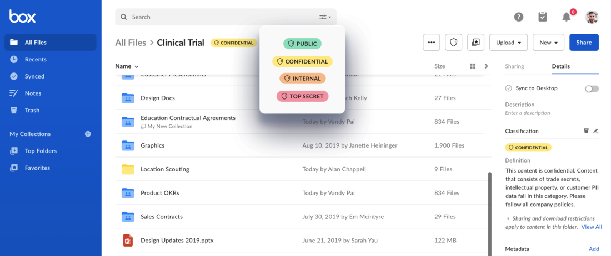

# 分類

Boxを使用すると、ユーザーおよびアプリケーションは、セキュリティ分類ラベルをファイルを適用したり、分類ラベルをフォルダとそのコンテンツにカスケードしたりできます。分類は、BoxのGovernanceおよびShield製品から不注意でアクセスされないよう、共有した機密性の高いコンテンツを保護するのに役立ちます。

分類APIを使用すると、新しい分類ラベルを作成したり、分類をファイルやフォルダに割り当てたりすることができます。

<ImageFrame border center>

</ImageFrame>

分類では、[メタデータAPI](g://metadata)を使用して、分類ラベルを作成したり、分類をファイルやフォルダに割り当てたりします。メタデータテンプレートとメタデータインスタンスの詳細については、[メタデータ](g://metadata)に関するガイドを参照してください。

## 分類とメタデータ

分類を使用する場合、開発者はメタデータテンプレートとメタデータインスタンスを操作する必要があります。

* **分類テンプレート:** 分類を使用するために、会社では、1つ以上の分類を含む分類メタデータテンプレートを用意する必要があります。このテンプレートでは、`scope`/`templateKey`を`enterprise.securityClassification-6VMVochwUWo`にしておく必要があります。このテンプレートは、使用可能な分類レベル、そのラベル名、説明、`colorID`値を保持します。
* **テンプレートインスタンス**: ファイルやフォルダに分類を適用するために、開発者は、`enterprise.securityClassification-6VMVochwUWo`テンプレートのインスタンスを項目に適用します。テンプレートが適用されると、テンプレート上の分類のリストから分類のいずれかが選択されます。