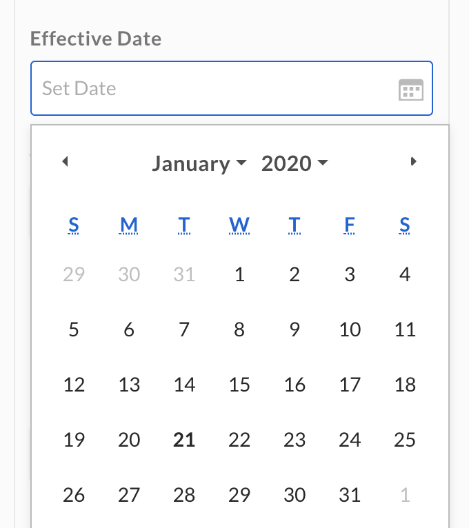

---
related_endpoints:
  - post_metadata_templates
  - put_metadata_templates_id_id_schema
related_guides:
  - metadata/templates/create
  - metadata/templates/update
related_resources:
  - metadata_template
category_id: metadata
subcategory_id: metadata/3-fields
is_index: false
id: metadata/fields/date
rank: 3
type: guide
total_steps: 5
sibling_id: metadata/fields
parent_id: metadata/fields
next_page_id: metadata/fields/enum
previous_page_id: metadata/fields/float
source_url: >-
  https://github.com/box/developer.box.com/blob/main/content/guides/metadata/3-fields/3-date.md
---
# Date metadata field

A metadata field of type `date` is displayed to a user as a date picker.

<ImageFrame border center shadow width='400'>



</ImageFrame>

<Message notice>

Although dates are presented to users in the Box Web app as date-pickers, the
actual dates are actually stored as in `RFC3339` format, with up to
millisecond precision. The time part of the date is always set to `T00:00:00.000Z`.

</Message>

## Create a date field

A `date` field can be added to a metadata template either when [creating a
metadata template][g_create_template], or when [updating a
template][g_update_template] with the `addField` operation.

The required attributes for a `date` field are a `type`, a `displayName` and a
`key`.

```json
{
  "scope": "enterprise",
  "displayName": "Contract",
  "fields": [
    {
      "type": "date",
      "key": "effective_date",
      "displayName": "Effective Date",
      "description": "The effective date when the contract goes in effect",
      "hidden": false
    }
  ]
}
```

Optionally a `description` can be provided that is shown to a user in the UI,
and the field can be set to `hidden` to hide it from users in the web and mobile
apps.

## Update a date field

A `date` template field can be updated by [updating the
template][g_update_template] it belongs to. Updates to templates happen through
**operations** to ensure that any template that is already assigned to a file or
folder is updated as well.

When updating a `date` metadata field the only relevant operation is the
`editField` operation which can be used to change the field's `key`,
`displayName`, `description` and `hidden` values.

```json
[
  {
    "op": "editField",
    "fieldKey": "effective_date",
    "data": {
      "displayName": "Effective Contract Date",
      "description": "The contract's effective date",
      "key": "effective_contract_date",
      "hidden": true
    }
  }
]
```

<Message warning>

This will affect existing instances of this template.

</Message>

[g_create_template]: g://metadata/templates/create
[g_update_template]: g://metadata/templates/update