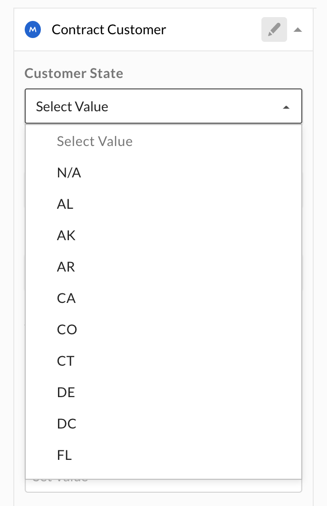

---
related_endpoints:
  - post_metadata_templates
  - put_metadata_templates_id_id_schema
related_guides:
  - metadata/templates/create
  - metadata/templates/update
related_resources:
  - metadata_template
category_id: metadata
subcategory_id: metadata/fields
is_index: false
id: metadata/fields/enum
rank: 4
type: guide
total_steps: 5
sibling_id: metadata/fields
parent_id: metadata/fields
next_page_id: metadata/fields/multi-select
previous_page_id: metadata/fields/date
source_url: >-
  https://github.com/box/developer.box.com/blob/main/content/guides/metadata/fields/enum.md
fullyTranslated: true
---
# 列挙型メタデータフィールド

`enum`タイプのメタデータフィールドは、ドロップダウンリストとしてユーザーに表示されます。ユーザーはリストから項目を1つ選択できます。

<ImageFrame border center shadow width="400">



</ImageFrame>

<Message notice>

`enum`を使用すると、ユーザーは0個または1個の値を選択できます。ユーザーが複数の値を選択できるようにするには、[`multiSelect`][g_multi_select]テンプレートフィールドを使用します。

</Message>

## `enum`フィールドの作成

`enum`フィールドは、[メタデータテンプレートの作成][g_create_template]時、または`addField`操作による[テンプレートの更新][g_update_template]時にメタデータテンプレートに追加できます。

`enum`フィールドの必須属性は、`type`、`displayName`、`key`、およびオプションのリストです。

```json
{
  "scope": "enterprise",
  "displayName": "Contract",
  "fields": [
    {
      "type": "enum",
      "key": "customer_state",
      "displayName": "Customer State",
      "description": "The US state where the customer is located",
      "hidden": false,
      "options": [
        {"key": "N/A"},
        {"key": "AL"},
        {"key": "AK"}
      ]
    }
  ]
}

```

必要に応じて、UIでユーザーに表示される`description`を指定できます。また、このフィールドを`hidden`に設定して、ウェブアプリとモバイルアプリでユーザーに表示されないようにすることもできます。

## `enum`フィールドの更新

`enum`テンプレートフィールドは、このフィールドが属する[テンプレートを更新][g_update_template]することで更新できます。テンプレートの更新は、ファイルまたはフォルダにすでに割り当てられているテンプレートも確実に更新される**操作**によって行われます。

### 基本的なフィールド値の変更

`enum`メタデータフィールドを更新する際に可能な操作の1つとして、フィールドの`key`、`displayName`、`description`、および`hidden`の値を変更するのに使用できる`editField`操作があります。

```json
[
  {
    "op": "editField",
    "fieldKey": "customer_state",
    "data": {
      "displayName": "Customer State (USA)",
      "key": "customer_state_usa"
    }
  }
]

```

<Message>

ここにある`fieldKey`は、変更するフィールドの元のキーを表します。`data.key`フィールドはフィールドの新しいキーです。

</Message>

<Message warning>

これは、このテンプレートの既存のインスタンスに影響します。

</Message>

### オプションの追加

`enum`フィールドにオプションを追加するには、`addEnumOption`操作を使用します。この操作では、`fieldKey`に、変更する`enum`フィールドのキーを設定するほか、`data`オブジェクトには、追加する新しいオプションの`key`を指定する必要があります。

```json
[
  {
    "op": "addEnumOption",
    "fieldKey": "customer_state",
    "data": {
      "key": "AR"
    }
  }
]

```

オプションのリストは次のようになります。

```json
...
"options": [
  {"key": "N/A"},
  {"key": "AL"},
  {"key": "AK"},
  {"key": "AR"}
]
...

```

<Message warning>

これは、このテンプレートの既存のインスタンスに影響します。

</Message>

### オプションの並べ替え

`enum`フィールドでオプションを並べ替えるには、`reorderEnumOptions`操作を使用します。この操作では、`fieldKey`に、変更する`enum`フィールドのキーを設定するほか、`enumOptionKeys`配列にはオプションのキーを順番に指定する必要があります。

```json
[
  {
    "op": "reorderEnumOptions",
    "fieldKey": "customer_state",
    "enumOptionKeys": [
      "AL",
      "AK",
      "AR",
      "N/A"
    ]
  }
]

```

オプションのリストは次のようになります。

```json
...
"options": [
  {"key": "AL"},
  {"key": "AK"},
  {"key": "AR"},
  {"key": "N/A"}
]
...

```

<Message warning>

この操作では、新しいオプションを追加することはできません。これは、このテンプレートの既存のインスタンスに影響します。

</Message>

### オプションの編集

`enum`フィールドのオプションを編集するには、`editEnumOption`操作を使用します。この操作では、`fieldKey`に、変更する`enum`フィールドのキーを設定し、`enumOptionKey`に、フィールドオプションのキーを設定する必要があります。最後に、`data`オブジェクトには、フィールドオプションの新しい`key`を指定する必要があります。

```json
[
  {
    "op": "editEnumOption",
    "fieldKey": "customer_state",
    "enumOptionKey": "N/A",
    "data": {
      "key": "Outside USA"
    }
  }
]

```

オプションのリストは次のようになります。

```json
...
"options": [
  {"key": "AL"},
  {"key": "AK"},
  {"key": "AR"},
  {"key": "Outside USA"}
]
...

```

<Message warning>

これは、このテンプレートの既存のインスタンスに影響します。

</Message>

### オプションの削除

`enum`フィールドからオプションを削除するには、`removeEnumOption`操作を使用します。この操作では、`fieldKey`に、変更する`enum`フィールドのキーを設定し、`enumOptionKey`に、削除するフィールドオプションのキーを設定します。

```json
[
  {
    "op": "removeEnumOption",
    "fieldKey": "customer_state",
    "enumOptionKey": "AL"
  }
]

```

オプションのリストは次のようになります。

```json
...
"options": [
  {"key": "AK"},
  {"key": "AR"},
  {"key": "Outside USA"}
]
...

```

<Message warning>

これは、このテンプレートの既存のインスタンスに影響します。この値に設定されたすべてのフィールドでは、値が`null`にリセットされます。

</Message>

[g_create_template]: g://metadata/templates/create

[g_update_template]: g://metadata/templates/update

[g_multi_select]: g://metadata/fields/multi-select