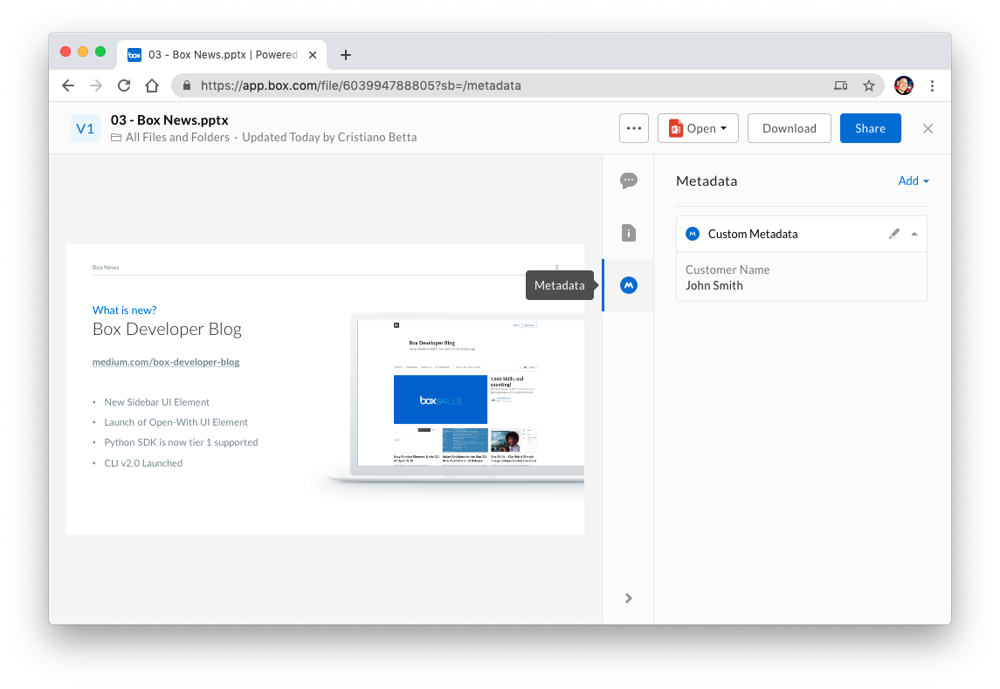

---
related_endpoints:
  - get_search
required_guides: []
category_id: search
subcategory_id: null
is_index: false
id: search/metadata-filters
rank: 5
type: guide
total_steps: 9
sibling_id: search
parent_id: search
next_page_id: search/enterprise
previous_page_id: search/pagination
source_url: >-
  https://github.com/box/developer.box.com/blob/main/content/guides/search/5-metadata-filters.md
fullyTranslated: true
---
# メタデータクエリフィルタ

[`GET /search`][search_api] APIでは、関連付けられたメタデータを使用して、検索結果にフィルタをかけることができます。`mdfilters`クエリパラメータを使用すると、開発者はメタデータテンプレートとクエリの対象となる値を指定できます。

<!-- markdownlint-disable line-length -->

<Tabs>

<Tab title="cURL">

```curl
curl -i -X GET "https://api.box.com/2.0/search?query=sales&mdfilters=%5B%7B%22scope%22%3A%22enterprise%22%2C%22templateKey%22%3A%22contract%22%2C%22filters%22%3A%7B%22category%22%3A%22online%22%7D%7D%5D" \
     -H "Authorization: Bearer <ACCESS_TOKEN>"

```

</Tab>

<Tab title="Java">

```java
long offsetValue = 0;
long limitValue = 10;

BoxSearch boxSearch = new BoxSearch(api);
BoxSearchParameters searchParams = new BoxSearchParameters();
searchParams.setQuery("sales");

BoxMetadataFilter bmf = new BoxMetadataFilter();
bmf.setScope("enterprise");
bmf.setTemplateKey("contract");
bmf.setFilter("category", "online")
searchParams.setMetadataFilter(bmf)

PartialCollection<BoxItem.Info> searchResults = boxSearch.searchRange(offsetValue, limitValue, searchParams);

```

</Tab>

<Tab title=".NET">

```dotnet
var filter = new
{
  category = "online"
};

var filters = new List<BoxMetadataFilterRequest>()
{
    new BoxMetadataFilterRequest()
    {
        Scope = "enterprise",
        TemplateKey = "contract",
        Filters: filter
    }
};
BoxCollection<BoxItem> results = await client.SearchManager
    .QueryAsync("sales", mdFilters: filters);

```

</Tab>

<Tab title="Python">

```py
from boxsdk.object.search import MetadataSearchFilter, MetadataSearchFilters

metadata_search_filter = MetadataSearchFilter(scope='enterprise', template_key='contract')
metadata_search_filter.add_value_based_filter(field_key='category', value='online')
metadata_search_filters = MetadataSearchFilters()
metadata_search_filters.add_filter(metadata_search_filter)

client.search().query("sales", metadata_filters=metadata_search_filters)

```

</Tab>

<Tab title="Node">

```js
client.search.query(
  'sales',
  {
    mdfilters: [
      {
        scope: 'enterprise',
        templateKey: 'contract',
        filters: {
          category: 'online;
        }
      }
    ]
  })
  .then(results => {
    // ...
  });

```

</Tab>

</Tabs>

<!-- markdownlint-enable line-length -->

<Message info>

この例では、`enterprise.contract`メタデータが追加され、`category`フィールドが`online`に設定されている項目によって、クエリ`sales`に一致するコンテンツの検索にフィルタをかけます。

</Message>

## メタデータの概要

メタデータを使用すると、ユーザーやアプリケーションは、ファイルやフォルダに関連付けられたカスタムデータを定義、格納できます。

<ImageFrame border center>



</ImageFrame>

メタデータは、ファイルまたはフォルダに割り当てられているキー/値ペアで構成されます。たとえば、重要な契約には、`clientNumber: 820183`と`category: online`のキー/値ペアが使用されている場合があります。

`mdfilters`クエリパラメータを使用すると、開発者は、特定のメタデータが追加されているファイルとフォルダを検索できます。

<CTA to="g://metadata">

メタデータテンプレートおよびインスタンスの詳細を確認する

</CTA>

## メタデータフィルタ構文

`mdfilters`パラメータに現在指定できるフィルタは1つだけですが、今後拡張される可能性があります。

各フィルタでは、フィルタをかけるメタデータテンプレートの`scope`および`templateKey`を定義します。

```json
[
  {
    "scope": "enterprise",
    "templateKey": "contract",
    "filters": {}
  }
]

```

<Message>

テンプレートの`scope`と`templateKey`を取得するには、会社の[すべてのメタデータテンプレートのリストを取得][g_list_templates]するか、[項目のすべてのメタデータインスタンスのリストを取得][g_list_instances_item]します。

</Message>

テンプレートが定義されると、`filters`フィールドではいくつかの異なるフィルタ形式が受け入れられます。フィルタの形式は、フィルタとして使用するフィールドのタイプによって大きく異なります。

### `string`フィールドによるフィルタ

`string`タイプのフィールドでフィルタをかけるには、フィルタでフィールドの`key`と、項目を検索する際に目的となる値を定義する必要があります。

```json
[
  {
    "scope": "enterprise",
    "templateKey": "contract",
    "filters": {
      "category": "online"
    }
  }
]

```

<Message info>

この例では、`enterprise.contract`テンプレートのインスタンスが適用されていて、キー`category`のフィールドが値`online`に設定されているすべてのファイルとフォルダが検索されます。

</Message>

### `float`フィールドによるフィルタ

`float`タイプのフィールドでフィルタをかけるには、`gt` (より大きい) や `lt` (より小さい) の値を指定して範囲を定義する必要があります。厳密な値を検索する場合は、`gt`と`lt`の両方に同じ値を入力できます。

```json
[
  {
    "scope": "enterprise",
    "templateKey": "contract",
    "filters": {
      "amount": {
        "gt": 10000,
        "lt": 20000
      }
    }
  }
]

```

<Message info>

この例では、`enterprise.contract`テンプレートのインスタンスが適用されていて、キー`amount`のフィールドが`10000`以上`2000`以下の値に設定されているすべてのファイルおよびフォルダが検索されます。`gt`と`lt`はその値を含むことと、両方を設定する必要がないことに注意してください。

</Message>

### `date`フィールドによるフィルタ

`date`タイプのフィールドでフィルタをかけるには、フィルタでフィールドの`key`と、項目の検索対象範囲を定義する必要があります。この範囲を定義するには、`gt` (より大きい) と`lt` (より小さい) の値を指定します。`gt`と`lt`はその値を含むことに注意してください。

```json
[
  {
    "scope": "enterprise",
    "templateKey": "contract",
    "filters": {
      "expirationDate": {
        "gt": "2016-08-01T00:00:00Z",
        "lt": "2017-08-01T00:00:00Z"
      }
    }
  }
]

```

<Message info>

この例では、`enterprise.contract`テンプレートのインスタンスが適用されていて、`expirationDate`が`2016-08-01T00:00:00Z`から`2017-08-01T00:00:00Z`までの日付に設定されているファイルとフォルダがすべて検索されます。

</Message>

### `enum`フィールドによるフィルタ

`enum`タイプのフィールドでフィルタをかけるには、フィルタでフィールドの`key`と、項目を検索する際に目的となる値を定義する必要があります。

```json
[
  {
    "scope": "enterprise",
    "templateKey": "contract",
    "filters": {
      "category": "online"
    }
  }
]

```

<Message info>

この例では、`enterprise.contract`テンプレートのインスタンスが適用されていて、キー`category`のフィールドが値`online`に設定されているすべてのファイルとフォルダが検索されます。

</Message>

### `multiSelect`フィールドによるフィルタ

`multiSelect`タイプのフィールドでフィルタをかけるには、フィルタでフィールドの`key`と、項目の検索で対象とする可能性がある値を定義する必要があります。検索を実行すると、クエリでは基本的に`OR`演算が実行され、指定した値のいずれかがこのフィールドと一致するテンプレートが取得されます。

```json
[
  {
    "scope": "enterprise",
    "templateKey": "contract",
    "filters": {
      "category": [
        "online",
        "enterprise"
      ]
    }
  }
]

```

<Message info>

この例では、`enterprise.contract`テンプレートのインスタンスが適用されていて、キー`category`のフィールドが値`online`または`enterprise`に設定されているすべてのファイルとフォルダが検索されます。

</Message>

[search_api]: e://get_search

[g_list_templates]: g://metadata/templates/list

[g_list_instances_item]: g://metadata/instances/list
