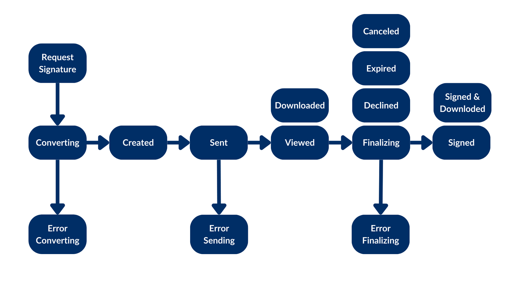

# Your first request

## Creating a signature request

Imagine that you have a document stored in Box and you want to send it to a
customer for signature. At minimum your app will need to know what document to
sign, where to store the signed document, and the signer email.

You can use the Box Sign API or one of the available SDK's to create a
signature request. Consider this example:

<Tabs>

<Tab title='cURL'>

```bash

curl --location 'https://api.box.com/2.0/sign_requests' \
--header 'Content-Type: application/json' \
--header 'Authorization: Bearer <access token>'
--data-raw '{
    "is_document_preparation_needed": true,
    "parent_folder": {
        "id": "234102987614",
        "type": "folder"
    },
    "source_files": [
        {
            "id": "1355143830404",
            "type": "file"
        }
    ],
    "signers": [
        {
            "email": "signer@gmail.com",
            "role": "signer"
        }
    ]
}'

```

</Tab>

<Tab title='Python Gen SDK'>

```python

def sign_doc_single(
    client: Client,
    document_id: str,
    destination_folder_id: str,
    signer_email: str,
    prep_needed: bool = False,
) -> SignRequest:
    # Sign request params
    source_file = FileBase(id=document_id, type=FileBaseTypeField.FILE)
    destination_folder = FolderMini(
        id=destination_folder_id, type=FolderBaseTypeField.FOLDER
    )
    signer = SignRequestCreateSigner(signer_email)
    # sign document
    sign_request = client.sign_requests.create_sign_request(
        signers=[signer],
        parent_folder=destination_folder,
        source_files=[source_file],
        is_document_preparation_needed=prep_needed,
    )

    return sign_request

def main():
    conf = ConfigOAuth()
    client = get_client_oauth(conf)

    # Simple sign a pdf request with preparation
    sign_pdf_prep = sign_doc_single(
        client, SIMPLE_PDF, SIGN_DOCS_FOLDER, SIGNER_A, True
    )

    if sign_pdf_prep.prepare_url is not None:
        open_browser(sign_pdf_prep.prepare_url)

```

</Tab>

</Tabs>

This will result in a signature request with a prepare document URL
(simplified):

<Tabs>

<Tab title='cURL'>

```json

{
    "is_document_preparation_needed": true,
    "signers": [
        {
            "email": "requester@gmail.com",
            "role": "final_copy_reader",
        },
        {
            "email": "signer@gmail.com",
            "role": "signer",
        }
    ],
    "id": "348decab-48a8-4f2c-9436-8967afebf7bb",
    "prepare_url": "https://app.box.com/sign/document/xyz-abc-123/.../prepare_doc/",
    "source_files": [
        {
            "id": "1355143830404",
            "type": "file",
        }
    ],
    "parent_folder": {
        "id": "234102987614",
        "type": "folder",
    },
    "name": "Simple-PDF.pdf",
    "type": "sign-request",
    "status": "converting",
    "sign_files": {
        "files": [
            {
                "id": "1381301154812",
                "type": "file",
            }
        ],
        "is_ready_for_download": true
    },
    "template_id": null
}

```

</Tab>

<Tab title='Python Gen SDK'>

```YAML

Simple sign request with prep: xyz-abc-123
  Status: converting
  Signers: signer@gmail.com
Prepare url: https://app.box.com/sign/document/xyz-abc-123/.../prepare_doc/

```

</Tab>

</Tabs>

## Check the status of the signature request

The signature request is an asynchronous process, and can generate errors.
Your application should check the status of the request before proceeding, and
handle any errors.

A signature request can have the following statuses:



- `converting`: The file is converted to a `.pdf` for the signing process once
the sign request is sent.
- `error_converting`: An issue was encountered while converting the file to a
`.pdf`.
- `created`: If `document_preparation_is_needed` is set to `true`, but the
`prepare_url` has not yet been visited.
- `sent`: The request was successfully sent, but no signer has interacted with
it.
- `error_sending`: An issue was encountered while sending the request.
- `viewed`: Once the first, or only, signer clicks on **Review document** in
the signing email or visits the signing URL.
- `downloaded`: The signing document was downloaded by signer.
- `signed`: All signers completed the request.
- `signed and downloaded`: The signing document was signed and downloaded by
signer.
- `declined`: If any signer declines the request.
- `cancelled`: If the request is cancelled via UI or API.
- `expired`: The date of expiration has passed with outstanding, incomplete
signatures.
- `finalizing`: If all signers have signed the request,
but the final document with signatures and the signing
log has not been generated yet.
- `error_finalizing`: If the `finalizing` phase did not complete successfully.

## Preparing the document

Depending on your technical use case you may need to prepare the document. In
this specific example, we are signing a PDF, and the Box sign engine has no
idea where to place the signature pad or any other inputs. This is why we used
the `is_document_preparation_needed` flag.

If a prepare URL is present, then your application should open the preparation
URL in a browser, where the requester can add the signature pad and any other
inputs needed for the signer to complete the document.

Once the document is prepared, the requester can send the signature request to
the signer.

This preparation step is not always necessary. Take a look at the [technical
use cases][technical-use-cases] for more information.

## Completing the signature request

The signer then receives an email from Box with a link to the signature
request. The signer can click the link and sign the document.

When the process is completed, both a signature log containing metadata and
the signed document are stored in the destination folder.

Congratulations! You have successfully created your first signature request.

<Message type='notice'>

This represents the simplest use case for Box Sign. The create method has many
options that you can use to customize your signature request.

Be sure to check the [request options][request-options], and the
[technical use cases][technical-use-cases] sections for more
information.

</Message>

[request-options]:page://sign/request-options
[technical-use-cases]:page://sign/technical-use-cases