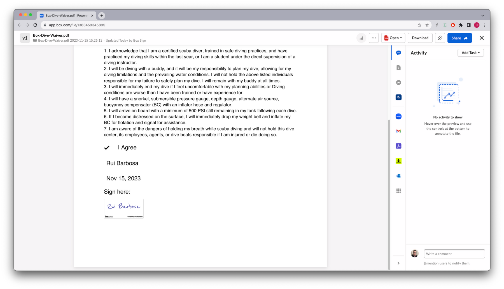

# 構造化されたドキュメントへの署名

Box Signのコンテキストにおける構造化されたドキュメントとは、Box Sign APIが認識できる特殊なタグを含むドキュメントのことです。これらのタグは、特定の署名者に関連付けられた署名プロパティ (名前、日付、署名など) をドキュメント内に配置するために使用されます。

これにより、アプリでは、署名の準備が整った、動的に生成されたドキュメントを処理できます。これには、いくつかの利点があります。

* ドキュメントを動的に生成できます。また、署名リクエストを作成する前に署名プロパティをドキュメントに追加できるため、実質的にドキュメントの準備手順を省略できます。

* ドキュメントの形式はBox Signテンプレートの外部で処理できるため、柔軟性が高まり、外部のドキュメント管理システムとの統合が可能になります。

## 構造化されたドキュメントの詳細

構造化されたドキュメントの例を以下に示します。この例では、Microsoft Wordドキュメントにタグを配置する際に使用される書式を示しています。


上の例では、`[[c|1]]`は署名者1に割り当てられたチェックボックスを指し、`[[s|
1]]`は署名者1に割り当てられた署名パッドを指します。署名パッドでフォントサイズ48を使用して、署名用のスペースを縦方向に確保していることに注目してください。

`[[t|1|id:tag_full_name|n:enter your complete name]]`は、ラベル`enter your complete name`とID `tag_full_name`を使用して、署名者1に割り当てられた名前タグを指します。

利用可能なすべてのタグの詳細な説明については、こちらの[ドキュメント][support-tags]を参照してください。

タグを背景と同じ`color`に設定すると、タグは見えなくなりますが、そこに存在はしています。

タグ内の番号は、署名順序ではなく、署名者の番号を指すため、`[[c|1]]`は署名者1のチェックボックス、`[[c|2]]`は署名者2のチェックボックスのようになります。

タグ0は送信者用に予約されており、必ず存在します。そのため、送信者がドキュメントにデータを入力する必要がない場合でも、他の署名者には1以降の番号を割り当てる必要があります。

## 構造化されたドキュメントからの署名リクエストの作成

これは、非構造化ドキュメントから署名リクエストを作成する場合と同じです。少なくとも、ドキュメント、受信用フォルダ、および`signer`のメールアドレスを指定する必要があります。

構造化されたドキュメントにはすでに署名プロパティの詳細と場所が含まれているため、ドキュメントの準備は省略できます。

このフローは次のようになり、ドキュメントの生成から始まり、署名リクエストを作成して、最後にドキュメントに署名します。


次のメソッドを考えてみましょう。

<Tabs>

<Tab title="cURL">

```bash

curl --location 'https://api.box.com/2.0/sign_requests' \
--header 'Content-Type: application/json' \
--header 'Authorization: Bearer nQ...xY'
--data-raw '{
    "source_files": [
        {
            "type": "file",
            "id": "1363379762284"
        }
    ],
    "parent_folder": {
        "id": "234102987614",
        "type": "folder"
    },
    "signers": [
        {
            "email": "signer@example.com",
            "role": "signer"
        }
    ]
}'

```

</Tab>

<Tab title="Pythonの次世代SDK">

```python

def create_sign_request_structured(
    client: Client, file_id: str, signer_email: str
) -> SignRequest:
    """Create a sign request with structured data"""

    # Sign request params
    source_file = FileBase(id=file_id, type=FileBaseTypeField.FILE)
    parent_folder = FolderMini(
        id=SIGN_DOCS_FOLDER, type=FolderBaseTypeField.FOLDER
    )
    signer = SignRequestCreateSigner(signer_email)

    # Create a sign request
    sign_request = client.sign_requests.create_sign_request(
        signers=[signer],
        parent_folder=parent_folder,
        source_files=[source_file],
    )

    return sign_request

def main():
    ...

    # Create a sign request with structured data
    sign_request = create_sign_request_structured(
        client, STRUCTURED_DOC, SIGNER_A
    )
    check_sign_request(sign_request)    

```

</Tab>

</Tabs>

結果は次のとおりです (簡略化されています)。

<Tabs>

<Tab title="cURL">

```json
{
    "is_document_preparation_needed": false,
    "signers": [
        {
            "email": "sender@example.com",
            "role": "final_copy_reader",
        },
        {
            "email": "signer@example.com",
            "role": "signer",
        }
    ],
    "id": "28199d6c-4662-471e-8426-4cbba9affcf1",
    "source_files": [
        {
            "id": "1363379762284",
            "type": "file",
            "name": "Box-Dive-Waiver.docx",
        }
    ],
    "parent_folder": {
        "id": "234102987614",
        "type": "folder",
        "name": "signed docs"
    },
    "name": "Box-Dive-Waiver.pdf",
    "type": "sign-request",
    "status": "converting",
    "sign_files": {
        "files": [
            {
                "id": "1393138856442",
                "type": "file",
                "name": "Box-Dive-Waiver.pdf",
            }
        ],
    },
}

```

</Tab>

<Tab title="Pythonの次世代SDK">

```yaml

Simple sign request: 6878e048-e9bd-4fb1-88c6-8e502783e8d0
  Status: converting
  Signers: 2
    final_copy_reader: sender@example.com
    signer: signer@example.com
  Prepare url: None

```

</Tab>

</Tabs>

If you go to the **signer** email inbox, open the email from Box Sign, click the **Review Document** button, you'll see the document with the signature properties in place:


処理を完了すると、署名済みドキュメントは次のようになります。



## 署名の属性の事前入力

ドキュメントのタグに外部IDが設定されている場合は、その外部IDを使用して値を事前入力できます。たとえば、`tag_full_name`を使用して署名者の名前を事前に入力できます。

次のメソッドを確認してください。

<Tabs>

<Tab title="cURL">

```bash
curl --location 'https://api.box.com/2.0/sign_requests' \
--header 'Content-Type: application/json' \
--header 'Authorization: Bearer nQ...xY'
--data-raw '{
    "prefill_tags": [
        {
            "document_tag_id": "tag_full_name",
            "text_value": "Signer A"
        }
    ],
    "source_files": [
        {
            "type": "file",
            "id": "1363379762284"
        }
    ],
    "parent_folder": {
        "id": "234102987614",
        "type": "folder"
    },
    "signers": [
        {
            "email": "signer@example.com",
            "role": "signer"
        }
    ]
}'

```

</Tab>

<Tab title="Pythonの次世代SDK">

```python

def create_sign_request_structured_with_prefill(
    client: Client, file_id: str, signer_name, signer_email: str
) -> SignRequest:
    """Create a sign request with structured data"""

    # Sign request params
    source_file = FileBase(id=file_id, type=FileBaseTypeField.FILE)
    parent_folder = FolderMini(
        id=SIGN_DOCS_FOLDER, type=FolderBaseTypeField.FOLDER
    )
    signer = SignRequestCreateSigner(signer_email)

    # tags
    tag_full_name = SignRequestPrefillTag(
        document_tag_id="tag_full_name",
        text_value=signer_name,
    )

    # Create a sign request
    sign_request = client.sign_requests.create_sign_request(
        signers=[signer],
        parent_folder=parent_folder,
        source_files=[source_file],
        prefill_tags=[tag_full_name],
    )

    return sign_request

def main():
    ...

    # Create a sign request with name pre populate
    sign_request_pre_pop = create_sign_request_structured_with_prefill(
        client, STRUCTURED_DOC, "Signer A", SIGNER_A
    )
    check_sign_request(sign_request_pre_pop)    

```

</Tab>

</Tabs>

結果は次のとおりです (簡略化されています)。

<Tabs>

<Tab title="cURL">

```json

{
    "is_document_preparation_needed": false,
    "redirect_url": null,
    "declined_redirect_url": null,
    "are_text_signatures_enabled": true,
    "signature_color": null,
    "is_phone_verification_required_to_view": false,
    "email_subject": null,
    "email_message": null,
    "are_reminders_enabled": false,
    "signers": [
        {
            "email": "sender@example.com",
            "role": "final_copy_reader",
        },
        {
            "email": "signer@example.com",
            "role": "signer",
        }
    ],
    "id": "11ecebc0-a2b2-4c14-a892-3f56333cc4fa",
    "prefill_tags": [
        {
            "document_tag_id": "tag_full_name",
            "text_value": "Signer A",
        }
    ],
    "source_files": [
        {
            "id": "1363379762284",
            "type": "file",
            "name": "Box-Dive-Waiver.docx",
        }
    ],
    "parent_folder": {
        "id": "234102987614",
        "type": "folder",
        "name": "signed docs"
    },
    "name": "Box-Dive-Waiver (1).pdf",
    "type": "sign-request",
    "status": "converting",
    "sign_files": {
        "files": [
            {
                "id": "1393142670032",
                "type": "file",
                "name": "Box-Dive-Waiver (1).pdf",
            }
        ],
    },
}

```

</Tab>

<Tab title="Pythonの次世代SDK">

```yaml

Simple sign request: 7b86e46c-72ba-4568-a6ff-787077cca007
  Status: converting
  Signers: 2
    final_copy_reader: sender@example.com
    signer: signer@example.com
  Prepare url: None

```

</Tab>

</Tabs>

これで、ドキュメントには名前が事前入力されるようになりました。


## 署名済みドキュメントからの情報の抽出

たとえば、署名者の名前とその他のプロパティを署名済みドキュメントから抽出したいとします。これは、署名リクエストの情報を再度システムに紐付ける必要がある場合に便利です。

署名済みリクエストから情報を抽出するメソッドを作成しましょう。

<Tabs>

<Tab title="cURL">

```bash

curl --location 'https://api.box.com/2.0/sign_requests/
11ecebc0-a2b2-4c14-a892-3f56333cc4fa' \
--header 'Authorization: Bearer nQ...xY'

```

</Tab>

<Tab title="Pythonの次世代SDK">

```python

def check_sign_request_by_id(client: Client, sign_request_id: str):
    """Check sign request by id"""
    sign_request = client.sign_requests.get_sign_request_by_id(sign_request_id)

    print(f"\nSimple sign request: {sign_request.id}")
    print(f"  Status: {sign_request.status.value}")

    print(f"  Signers: {len(sign_request.signers)}")
    for signer in sign_request.signers:
        print(f"    {signer.role.value}: {signer.email}")
        for input in signer.inputs:
            content_type = input.content_type
            value = None

            if content_type == SignRequestSignerInputTypeField.CHECKBOX:
                value = input.checkbox_value
            elif content_type == SignRequestSignerInputTypeField.TEXT:
                value = input.text_value
            elif content_type == SignRequestSignerInputTypeField.DATE:
                value = input.date_value

            print(
                f"      {input.type.value}: {value if value is not None else '<other>'}"
            )

    print(f"  Prepare url: {sign_request.prepare_url}")

def main():
    ...

    # Latest sign request
    LATEST_SIGN_REQUEST = "7b86e46c-72ba-4568-a6ff-787077cca007"
    check_sign_request_by_id(client, LATEST_SIGN_REQUEST)    

```

</Tab>

</Tabs>

結果は次のとおりです (簡略化されています)。

<Tabs>

<Tab title="cURL">

```json

{
    "signers": [
        {
            "email": "sender@example.com",
            "role": "final_copy_reader",
        },
        {
            "email": "signer@example.com",
            "role": "signer",
            "signer_decision": {
                "type": "signed",
                "finalized_at": "2023-12-19T14:53:10.547Z",
            },
            "inputs": [
                {
                    "document_tag_id": null,
                    "checkbox_value": true,
                    "type": "checkbox",
                    "content_type": "checkbox",
                },
                {
                    "document_tag_id": "tag_full_name",
                    "text_value": "Signer A",
                    "type": "text",
                    "content_type": "text",
                },
                {
                    "document_tag_id": null,
                    "text_value": "Dec 19, 2023",
                    "date_value": "2023-12-19",
                    "type": "date",
                    "content_type": "date",
                },
                {
                    "document_tag_id": null,
                    "type": "signature",
                    "content_type": "signature",
                }
            ],
        }
    ],
    "id": "11ecebc0-a2b2-4c14-a892-3f56333cc4fa",
    "prefill_tags": [
        {
            "document_tag_id": "tag_full_name",
            "text_value": "Signer A",
        }
    ],
    "source_files": [
        {
            "id": "1363379762284",
            "type": "file",
            "name": "Box-Dive-Waiver.docx",
        }
    ],
    "parent_folder": {
        "id": "234102987614",
        "type": "folder",
        "name": "signed docs"
    },
    "name": "Box-Dive-Waiver (1).pdf",
    "type": "sign-request",
    "signing_log": {
        "id": "1393140642252",
        "type": "file",
        "name": "Box-Dive-Waiver (1) Signing Log.pdf",
    },
    "status": "signed",
    "sign_files": {
        "files": [
            {
                "id": "1393142670032",
                "type": "file",
                "name": "Box-Dive-Waiver (1).pdf",
            }
        ],
    },
}

```

</Tab>

<Tab title="Pythonの次世代SDK">

```yaml

Simple sign request: 7b86e46c-72ba-4568-a6ff-787077cca007
  Status: signed
  Signers: 2
    final_copy_reader: sender@example.com
    signer: signer@example.com
      checkbox: True
      text: Rui Barbosa
      date: 2023-11-15
      signature: <other>
  Prepare url: None

```

</Tab>

</Tabs>

## まとめ

構造化されたドキュメントの使用は、外部のドキュメント管理システムと統合して、署名可能な動的ドキュメントを作成するのに最適です。

ドキュメントの署名要件に多くの選択肢がある場合は、別のデータソースからこれらを事前に入力して、ユーザーの時間を節約することができます。ただし、これらのプロパティを所有するユーザーはいつでもプロパティを変更できます。

ドキュメントが署名された後に署名リクエストから情報を抽出することができるので、その情報を再度システムに紐付ける必要がある場合に便利です。

[support-tags]: https://support.box.com/hc/en-us/articles/4404085855251-Creating-templates-using-tags
