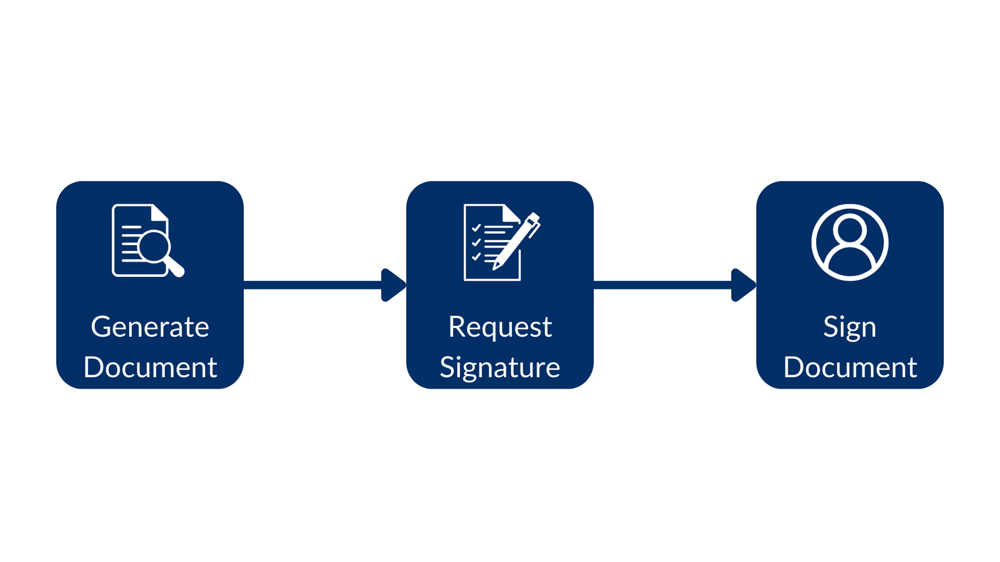
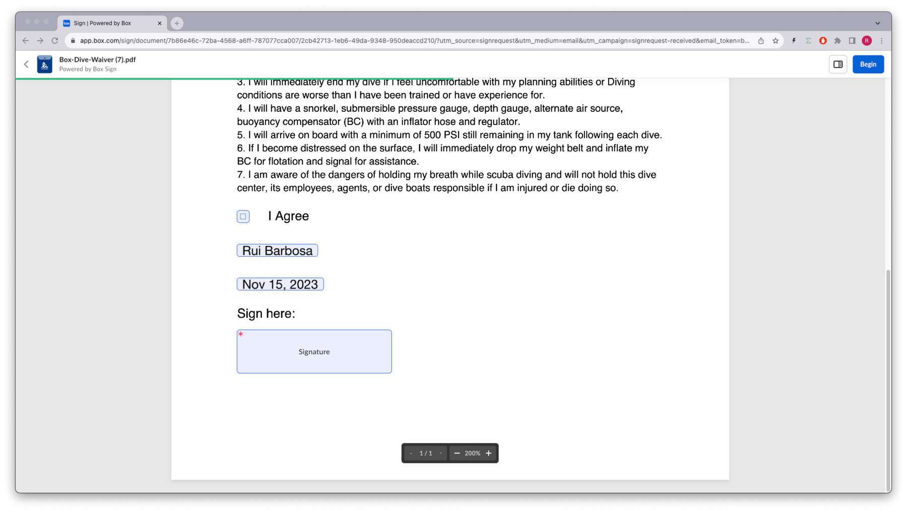

# Signing structured docs

A structured document in the context of Box Sign is a document that includes
specific tags that can be recognized by the Box Sign API. These tags are used
to place the signature properties associated with a specific signer in the
document, such as name, date, and signature.

This allows your app to handle a dynamic generated document that is ready to be
signed, which has a couple of advantages:

* The document can be dynamically generated, and the signature properties can
be added to the document before creating the signature request, effectively
bypassing the document preparation step.

* The document format can be handled outside of Box Sign templates, allowing
higher flexibility and integration with external document management systems.

## Anatomy of a structured document

Here is an example of a structured document, showing the formatting used to
place tags in a Microsoft Word document:


In the sample above `[[c|1]]` means a checkbox assigned to signer 1, and `[[s|
1]]` means a signature pad assigned to signer 1. Notice how the signature pad
is using font size 48 to reserve space vertically for the signature.

The `[[t|1|id:tag_full_name|n:enter your complete name]]` means a name tag
assigned to signer 1, with the label `enter your complete name`, and using an
id of `tag_full_name`.

Check out this [document][support-tags] for a complete description of all
the tags available.

Setting the tags to the same `color` as the background will make them
invisible, but they will still be there.

The number in the tags refer to the signer number, not the signing order, so
`[[c|1]]` is the checkbox for signer 1, `[[c|2]]` is the checkbox for signer 2,
and so on.

Tag 0 is reserved for the sender, and always exists. So even if the sender
does not need to input any data into the document, the other signers must start
with 1.

## Create a signature request from a structured document

This is the same as creating a signature request from an unstructured document.
At minimum, you will need to specify the document, the receiving folder and
the email of the `signer`.

Since the structured document already contains the signature properties details
and location, you can bypass the document preparation.

This is how the flow would look like, from the generated document, create the
signature request and finally sign the document:



Consider this method:

<Tabs>

<Tab title='cURL'>

```bash

curl --location 'https://api.box.com/2.0/sign_requests' \
--header 'Content-Type: application/json' \
--header 'Authorization: Bearer nQ...xY'
--data-raw '{
    "source_files": [
        {
            "type": "file",
            "id": "1363379762284"
        }
    ],
    "parent_folder": {
        "id": "234102987614",
        "type": "folder"
    },
    "signers": [
        {
            "email": "signer@example.com",
            "role": "signer"
        }
    ]
}'
    
```

</Tab>

<Tab title='Python Gen SDK'>

```python

def create_sign_request_structured(
    client: Client, file_id: str, signer_email: str
) -> SignRequest:
    """Create a sign request with structured data"""

    # Sign request params
    source_file = FileBase(id=file_id, type=FileBaseTypeField.FILE)
    parent_folder = FolderMini(
        id=SIGN_DOCS_FOLDER, type=FolderBaseTypeField.FOLDER
    )
    signer = SignRequestCreateSigner(signer_email)

    # Create a sign request
    sign_request = client.sign_requests.create_sign_request(
        signers=[signer],
        parent_folder=parent_folder,
        source_files=[source_file],
    )

    return sign_request

def main():
    ...

    # Create a sign request with structured data
    sign_request = create_sign_request_structured(
        client, STRUCTURED_DOC, SIGNER_A
    )
    check_sign_request(sign_request)    

```

</Tab>

</Tabs>

Resulting in (simplified):

<Tabs>

<Tab title='cURL'>

```json
{
    "is_document_preparation_needed": false,
    "signers": [
        {
            "email": "sender@example.com",
            "role": "final_copy_reader",
        },
        {
            "email": "signer@example.com",
            "role": "signer",
        }
    ],
    "id": "28199d6c-4662-471e-8426-4cbba9affcf1",
    "source_files": [
        {
            "id": "1363379762284",
            "type": "file",
            "name": "Box-Dive-Waiver.docx",
        }
    ],
    "parent_folder": {
        "id": "234102987614",
        "type": "folder",
        "name": "signed docs"
    },
    "name": "Box-Dive-Waiver.pdf",
    "type": "sign-request",
    "status": "converting",
    "sign_files": {
        "files": [
            {
                "id": "1393138856442",
                "type": "file",
                "name": "Box-Dive-Waiver.pdf",
            }
        ],
    },
}
    
```

</Tab>

<Tab title='Python Gen SDK'>

```yaml

Simple sign request: 6878e048-e9bd-4fb1-88c6-8e502783e8d0
  Status: converting
  Signers: 2
    final_copy_reader: sender@example.com
    signer: signer@example.com
  Prepare url: None

```

</Tab>

</Tabs>

If you go to the **signer** email inbox, open the email from Box Sign, click
the **Review Document** button, you'll see the document with the signature
properties in place:


After completing the process the signed document looks like this:


## Pre-populate the signature attributes

If you have an external id in the document tags you can use it to pre-populate
their values. For example, you can use the `tag_full_name` to pre-populate the
name of the signer.

See this method:

<Tabs>

<Tab title='cURL'>

```bash
curl --location 'https://api.box.com/2.0/sign_requests' \
--header 'Content-Type: application/json' \
--header 'Authorization: Bearer nQ...xY'
--data-raw '{
    "prefill_tags": [
        {
            "document_tag_id": "tag_full_name",
            "text_value": "Signer A"
        }
    ],
    "source_files": [
        {
            "type": "file",
            "id": "1363379762284"
        }
    ],
    "parent_folder": {
        "id": "234102987614",
        "type": "folder"
    },
    "signers": [
        {
            "email": "signer@example.com",
            "role": "signer"
        }
    ]
}'
    
```

</Tab>

<Tab title='Python Gen SDK'>

```python

def create_sign_request_structured_with_prefill(
    client: Client, file_id: str, signer_name, signer_email: str
) -> SignRequest:
    """Create a sign request with structured data"""

    # Sign request params
    source_file = FileBase(id=file_id, type=FileBaseTypeField.FILE)
    parent_folder = FolderMini(
        id=SIGN_DOCS_FOLDER, type=FolderBaseTypeField.FOLDER
    )
    signer = SignRequestCreateSigner(signer_email)

    # tags
    tag_full_name = SignRequestPrefillTag(
        document_tag_id="tag_full_name",
        text_value=signer_name,
    )

    # Create a sign request
    sign_request = client.sign_requests.create_sign_request(
        signers=[signer],
        parent_folder=parent_folder,
        source_files=[source_file],
        prefill_tags=[tag_full_name],
    )

    return sign_request

def main():
    ...

    # Create a sign request with name pre populate
    sign_request_pre_pop = create_sign_request_structured_with_prefill(
        client, STRUCTURED_DOC, "Signer A", SIGNER_A
    )
    check_sign_request(sign_request_pre_pop)    

```

</Tab>

</Tabs>

Resulting in (simplified):

<Tabs>

<Tab title='cURL'>

```json

{
    "is_document_preparation_needed": false,
    "redirect_url": null,
    "declined_redirect_url": null,
    "are_text_signatures_enabled": true,
    "signature_color": null,
    "is_phone_verification_required_to_view": false,
    "email_subject": null,
    "email_message": null,
    "are_reminders_enabled": false,
    "signers": [
        {
            "email": "sender@example.com",
            "role": "final_copy_reader",
        },
        {
            "email": "signer@example.com",
            "role": "signer",
        }
    ],
    "id": "11ecebc0-a2b2-4c14-a892-3f56333cc4fa",
    "prefill_tags": [
        {
            "document_tag_id": "tag_full_name",
            "text_value": "Signer A",
        }
    ],
    "source_files": [
        {
            "id": "1363379762284",
            "type": "file",
            "name": "Box-Dive-Waiver.docx",
        }
    ],
    "parent_folder": {
        "id": "234102987614",
        "type": "folder",
        "name": "signed docs"
    },
    "name": "Box-Dive-Waiver (1).pdf",
    "type": "sign-request",
    "status": "converting",
    "sign_files": {
        "files": [
            {
                "id": "1393142670032",
                "type": "file",
                "name": "Box-Dive-Waiver (1).pdf",
            }
        ],
    },
}
    
```

</Tab>

<Tab title='Python Gen SDK'>

```yaml

Simple sign request: 7b86e46c-72ba-4568-a6ff-787077cca007
  Status: converting
  Signers: 2
    final_copy_reader: sender@example.com
    signer: signer@example.com
  Prepare url: None

```

</Tab>

</Tabs>

The document now has the name pre-populated:



## Extract information from a signed document

Let's say you want to extract the name of the signer and the other properties
from the signed document. This is useful if you need to tie the information
from the signature request back into your systems.

Let's create a method to extract the information from the signed request:

<Tabs>

<Tab title='cURL'>

```bash

curl --location 'https://api.box.com/2.0/sign_requests/
11ecebc0-a2b2-4c14-a892-3f56333cc4fa' \
--header 'Authorization: Bearer nQ...xY'
    
```

</Tab>

<Tab title='Python Gen SDK'>

```python

def check_sign_request_by_id(client: Client, sign_request_id: str):
    """Check sign request by id"""
    sign_request = client.sign_requests.get_sign_request_by_id(sign_request_id)

    print(f"\nSimple sign request: {sign_request.id}")
    print(f"  Status: {sign_request.status.value}")

    print(f"  Signers: {len(sign_request.signers)}")
    for signer in sign_request.signers:
        print(f"    {signer.role.value}: {signer.email}")
        for input in signer.inputs:
            content_type = input.content_type
            value = None

            if content_type == SignRequestSignerInputTypeField.CHECKBOX:
                value = input.checkbox_value
            elif content_type == SignRequestSignerInputTypeField.TEXT:
                value = input.text_value
            elif content_type == SignRequestSignerInputTypeField.DATE:
                value = input.date_value

            print(
                f"      {input.type.value}: {value if value is not None else '<other>'}"
            )

    print(f"  Prepare url: {sign_request.prepare_url}")

def main():
    ...

    # Latest sign request
    LATEST_SIGN_REQUEST = "7b86e46c-72ba-4568-a6ff-787077cca007"
    check_sign_request_by_id(client, LATEST_SIGN_REQUEST)    

```

</Tab>

</Tabs>

Resulting in (simplified):

<Tabs>

<Tab title='cURL'>

```json

{
    "signers": [
        {
            "email": "sender@example.com",
            "role": "final_copy_reader",
        },
        {
            "email": "signer@example.com",
            "role": "signer",
            "signer_decision": {
                "type": "signed",
                "finalized_at": "2023-12-19T14:53:10.547Z",
            },
            "inputs": [
                {
                    "document_tag_id": null,
                    "checkbox_value": true,
                    "type": "checkbox",
                    "content_type": "checkbox",
                },
                {
                    "document_tag_id": "tag_full_name",
                    "text_value": "Signer A",
                    "type": "text",
                    "content_type": "text",
                },
                {
                    "document_tag_id": null,
                    "text_value": "Dec 19, 2023",
                    "date_value": "2023-12-19",
                    "type": "date",
                    "content_type": "date",
                },
                {
                    "document_tag_id": null,
                    "type": "signature",
                    "content_type": "signature",
                }
            ],
        }
    ],
    "id": "11ecebc0-a2b2-4c14-a892-3f56333cc4fa",
    "prefill_tags": [
        {
            "document_tag_id": "tag_full_name",
            "text_value": "Signer A",
        }
    ],
    "source_files": [
        {
            "id": "1363379762284",
            "type": "file",
            "name": "Box-Dive-Waiver.docx",
        }
    ],
    "parent_folder": {
        "id": "234102987614",
        "type": "folder",
        "name": "signed docs"
    },
    "name": "Box-Dive-Waiver (1).pdf",
    "type": "sign-request",
    "signing_log": {
        "id": "1393140642252",
        "type": "file",
        "name": "Box-Dive-Waiver (1) Signing Log.pdf",
    },
    "status": "signed",
    "sign_files": {
        "files": [
            {
                "id": "1393142670032",
                "type": "file",
                "name": "Box-Dive-Waiver (1).pdf",
            }
        ],
    },
}
    
```

</Tab>

<Tab title='Python Gen SDK'>

```yaml

Simple sign request: 7b86e46c-72ba-4568-a6ff-787077cca007
  Status: signed
  Signers: 2
    final_copy_reader: sender@example.com
    signer: signer@example.com
      checkbox: True
      text: Rui Barbosa
      date: 2023-11-15
      signature: <other>
  Prepare url: None

```

</Tab>

</Tabs>

## Summary

Structured documents are a great way to integrate with external document
management systems, creating dynamic documents that are ready for signature.

If your document signature requirements have a lot of options, you can
pre-populate these from another data source and save the user's time, but
remember that the user who owns these properties can always change them.

After the document is signed you can extract the information from the signature
request, which is useful if you need to tie it back into your systems.

[support-tags]:https://support.box.com/hc/en-us/articles/4404085855251-Creating-templates-using-tags